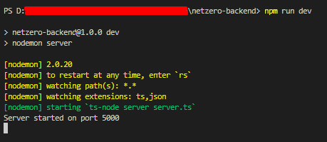

# Netzero (backend)

## Live site

## Contact info
- **Email:** dejanteofilovic2@gmail.com
- **Discord:** [dejan_teofilovic](https://discord.gg/PztT2r5U)

## Release date
Mar 20, 2023

## Environment
- `Node.js v18.12.1`

## Stack
- **Framework:** `Express.js v4.18.2`
- **Database:** `MySQL v8.0.27-winx64`

## How to run the project.
1. Please open terminal window in the root directory.
2. Please run command `npm run start` in it.

